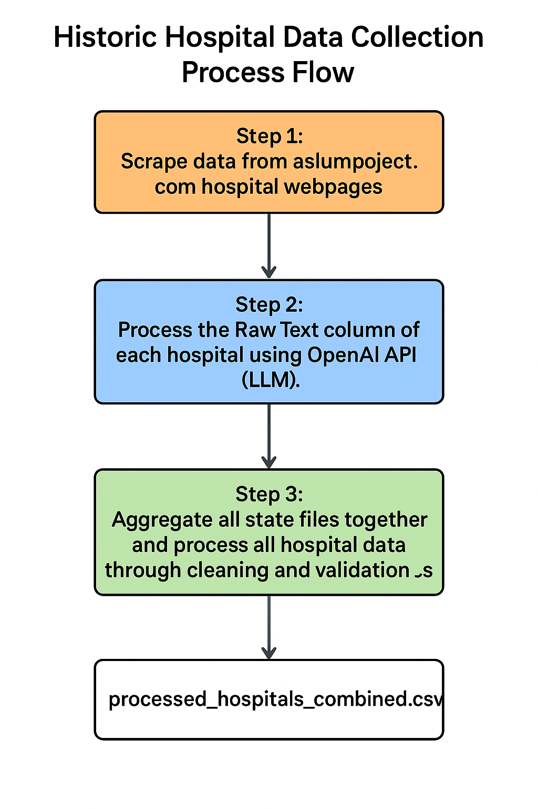
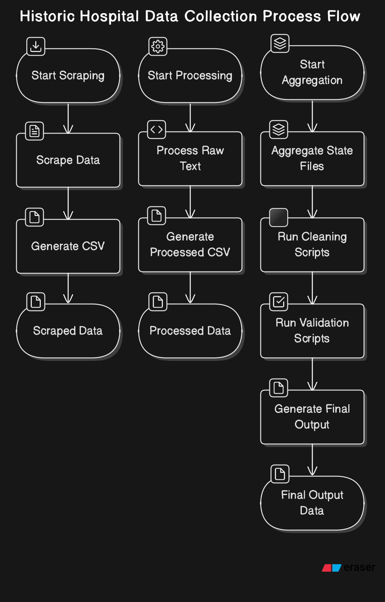

# Pipeline Process Documentation

This document provides an overview of the steps performed by the `run_pipeline` script and explains how the OpenAI API is utilized within the process.

### Data Dictionary

#### Table 1 - Scraped Data from Hospital Webpage Infobox

| Column Name               | Data Type | Description                                                                 |
|---------------------------|-----------|-----------------------------------------------------------------------------|
| `State`                   | String    | The state where the hospital is located.                                   |
| `Hospital Name`           | String    | The name of the hospital.                                                  |
| `URL`                     | String    | The URL of the hospital's page on asylumproject.com.                       |
| `Established`             | Float     | The year the hospital was established (if available).                      |
| `Construction Began`      | Float     | The year construction began on the hospital (if available).                |
| `Opened`                  | String    | The year the hospital officially opened.                                   |
| `Current Status`          | String    | The current operational status of the hospital (e.g., active, closed).     |
| `Building Style`          | String    | The architectural style of the hospital building.                          |
| `Architect(s)`            | String    | The name(s) of the architect(s) who designed the hospital (if available).  |
| `Alternate Names`         | String    | Alternate names or nicknames for the hospital.                             |
| `Raw Text`                | String    | Raw textual information extracted from the hospital's individual page.     |
| `Closed`                  | String    | The year the hospital was closed (if applicable).                          |
| `Location`                | String    | The specific location of the hospital (e.g., city, address).               |
| `Architecture Style`      | Float     | The architectural style of the hospital (currently unused).                |
| `Peak Patient Population` | String    | The peak patient population recorded at the hospital (if available).       |

#### Table 2 - AI Processed Data from Hospital Webpage Text

| Column Name                   | Data Type | Description                                                                 |
|-------------------------------|-----------|-----------------------------------------------------------------------------|
| `year_opened_LLM`             | String    | The year the hospital was opened, extracted from the history text using LLM.|
| `year_closed_LLM`             | String    | The year the hospital was closed, extracted from the history text using LLM.|
| `number_of_beds_LLM`          | String    | The number of beds in the hospital, extracted from the history text using LLM.|
| `number_of_patients_LLM`      | String    | The number of patients in the hospital, extracted from the history text using LLM.|
| `peak_patient_population_LLM` | String    | The peak patient population recorded, extracted from the history text using LLM.|
| `hand_check_flag_LLM`         | Integer   | A flag indicating if manual review is required (1 = yes, 0 = no).          |

### LLM Processing Details

The following fields are extracted from the hospital history text using the OpenAI API LLM:

- **`year_opened_LLM`**: Extracted year the hospital opened.
- **`year_closed_LLM`**: Extracted year the hospital closed.
- **`number_of_beds_LLM`**: Extracted number of beds in the hospital.
- **`number_of_patients_LLM`**: Extracted number of patients in the hospital.
- **`peak_patient_population_LLM`**: Extracted peak patient population.
- **`hand_check_flag_LLM`**: Set to `1` if the text primarily discusses a different hospital or if all extracted fields are null; otherwise, set to `0`.

These fields are generated by processing the raw text column using the OpenAI API, which applies natural language understanding to extract structured information from unstructured text.

### Data Source

All data in this file, except for the `Raw Text` column, is sourced from the information boxes on individual hospital pages on [asylumproject.com](https://asylumproject.com). The `Raw Text` column contains unstructured textual data extracted from the main content of these pages.

## Overview of the Pipeline

The `run_pipeline` script is designed to process historic hospital data by performing the following steps:

### 1. Data Ingestion
- **Description**: The script begins by loading raw data from specified input sources (e.g., CSV files, databases, or APIs).
- **Purpose**: This step ensures that all necessary data is available for processing.

### 2. Data Cleaning
- **Description**: The raw data is cleaned to remove inconsistencies, handle missing values, and standardize formats.
- **Purpose**: Cleaning ensures the data is in a usable state for further processing.

### 3. Data Transformation
- **Description**: The cleaned data is transformed into a structured format suitable for analysis. This may include normalization, aggregation, or feature engineering.
- **Purpose**: Transformation prepares the data for downstream tasks.

### 4. OpenAI API Integration
- **Description**: The script uses the OpenAI API to perform tasks such as:
  - Text summarization
  - Natural language processing (e.g., extracting insights from text fields)
  - Generating metadata or annotations
- **Purpose**: The OpenAI API enhances the pipeline by leveraging advanced AI capabilities to process and analyze textual data.

### 5. Data Validation
- **Description**: The processed data is validated to ensure accuracy and consistency. This step may involve comparing results against predefined rules or benchmarks.
- **Purpose**: Validation ensures the integrity of the processed data.

### 6. Data Storage
- **Description**: The final processed data is stored in a designated output location (e.g., database, file system, or cloud storage).
- **Purpose**: Storing the data makes it accessible for reporting, analysis, or further use.

### 7. Reporting and Visualization (Optional)
- **Description**: The script may generate reports or visualizations to summarize the results of the pipeline.
- **Purpose**: Reporting provides insights into the processed data and the outcomes of the pipeline.

## Process Flow Diagrams

### Diagram 1: Overview of the Process Flow

### Diagram 2: Detailed Process Flow

## OpenAI API Usage

The OpenAI API is a critical component of the pipeline, providing advanced AI capabilities for processing textual data. Specific use cases include:
- **Text Summarization**: Condensing large text fields into concise summaries.
- **Natural Language Understanding**: Extracting key insights, entities, or relationships from unstructured text.
- **Metadata Generation**: Automatically generating tags, categories, or descriptions for data records.

The API is integrated into the pipeline through API calls, where the input data is sent to the OpenAI service, and the results are incorporated back into the pipeline for further processing.

## Conclusion

The `run_pipeline` script is a comprehensive tool for processing historic hospital data. By integrating the OpenAI API, it leverages state-of-the-art AI capabilities to enhance data processing and analysis.
