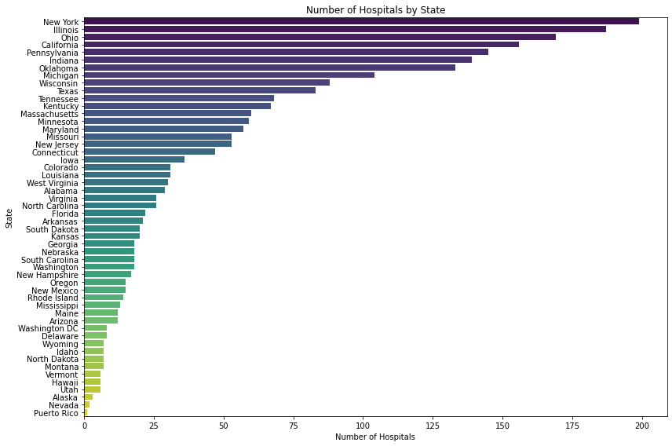
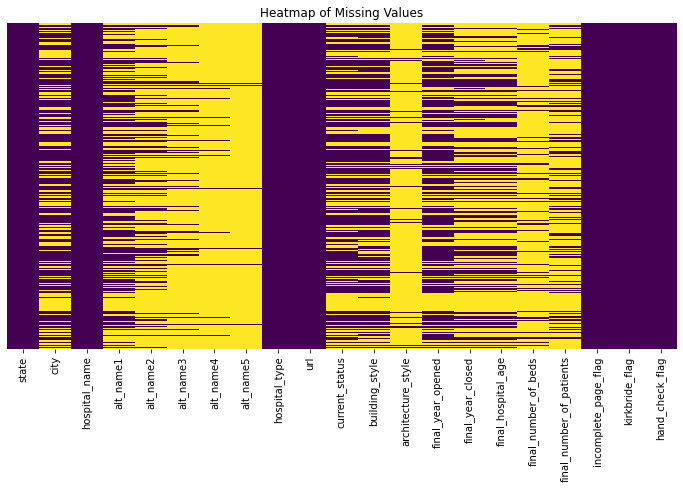

# 🏥 Hospital Dataset Summary

## Categorical Columns

| Column Name         | Non-Null Count | Unique Values | Most Frequent Value (Top)                      | Frequency |
|---------------------|----------------|----------------|-----------------------------------------------|-----------|
| state               | 2,397          | 52             | New York                                      | 199       |
| city                | 1,408          | 926            | Indianapolis                                  | 13        |
| hospital_name       | 2,397          | 2,244          | Jackson County Poor Farm                      | 6         |
| alt_name1           | 1,243          | 1,114          | *e                                            | 11        |
| alt_name2           | 781            | 691            | Eloise Hospital                               | 5         |
| alt_name3           | 385            | 327            | Wayne County Asylum                           | 5         |
| alt_name4           | 184            | 158            | Wayne County Psychiatric Hospital             | 5         |
| alt_name5           | 69             | 58             | Kingsboro State Hospital                      | 3         |
| hospital_type       | 2,397          | 46             | Sanitariums                                   | 398       |
| url                 | 2,397          | 2,303          | https://www.asylumprojects.org/...            | 6         |
| current_status      | 1,454          | 42             | Demolished                                    | 472       |
| building_style      | 1,423          | 60             | Single Building                               | 675       |
| architecture_style  | 193            | 92             | Colonial Revival                              | 17        |

## Numerical Columns

| Column Name              | Count  | Mean     | Std Dev  | Min     | 25%     | Median  | 75%     | Max     |
|--------------------------|--------|----------|----------|---------|---------|---------|---------|---------|
| final_year_opened        | 1,482  | 1898.89  | 37.60    | 1732.00 | 1873.00 | 1901.00 | 1920.00 | 2024.00 |
| final_year_closed        | 925    | 1973.74  | 29.20    | 1824.00 | 1960.00 | 1976.00 | 1995.00 | 2024.00 |
| final_hospital_age       | 913    | 77.03    | 38.93    | -26.00  | 50.00   | 73.00   | 104.00  | 245.00  |
| final_number_of_beds     | 306    | 423.43   | 711.50   | 10.00   | 72.75   | 144.00  | 490.00  | 5,768.00|
| final_number_of_patients | 587    | 2,495.01 | 6,999.82 | 5.00    | 126.00  | 506.00  | 2,300.00| 91,045.00|

## Flags (Binary Columns)

| Column Name           | Count | Mean | Std Dev | Min | 25% | Median | 75% | Max |
|------------------------|--------|------|---------|-----|-----|--------|-----|-----|
| incomplete_page_flag   | 2,397  | 0.34 | 0.48    | 0   | 0   | 0      | 1   | 1   |
| kirkbride_flag         | 2,397  | 0.04 | 0.19    | 0   | 0   | 0      | 0   | 1   |
| hand_check_flag        | 2,397  | 0.37 | 0.48    | 0   | 0   | 0      | 1   | 1   |

## Missing Values

| Column Name              | Missing Count | Missing Percent |
|--------------------------|----------------|------------------|
| `alt_name5`              | 2,328          | 97.12%          |
| `alt_name4`              | 2,213          | 92.32%          |
| `architecture_style`     | 2,204          | 91.95%          |
| `final_number_of_beds`   | 2,091          | 87.23%          |
| `alt_name3`              | 2,012          | 83.94%          |
| `final_number_of_patients`| 1,810         | 75.51%          |
| `alt_name2`              | 1,616          | 67.42%          |
| `final_hospital_age`     | 1,484          | 61.91%          |
| `final_year_closed`      | 1,472          | 61.41%          |
| `alt_name1`              | 1,154          | 48.14%          |
| `city`                   | 989            | 41.26%          |
| `building_style`         | 974            | 40.63%          |
| `current_status`         | 943            | 39.34%          |
| `final_year_opened`      | 915            | 38.17%          |
| `kirkbride_flag`         | 0              | 0.00%           |
| `incomplete_page_flag`   | 0              | 0.00%           |
| `state`                  | 0              | 0.00%           |
| `url`                    | 0              | 0.00%           |
| `hospital_type`          | 0              | 0.00%           |
| `hospital_name`          | 0              | 0.00%           |
| `hand_check_flag`        | 0              | 0.00%           |

## Figures

### Figure 1: Hospitals by State

### Figure 2: Missing Data Heat Map

